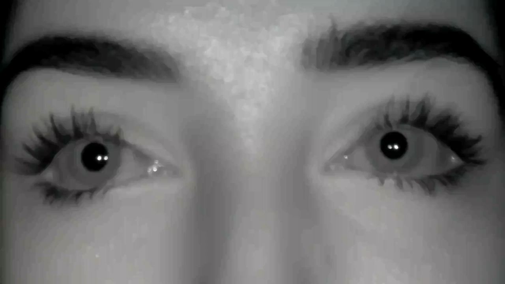
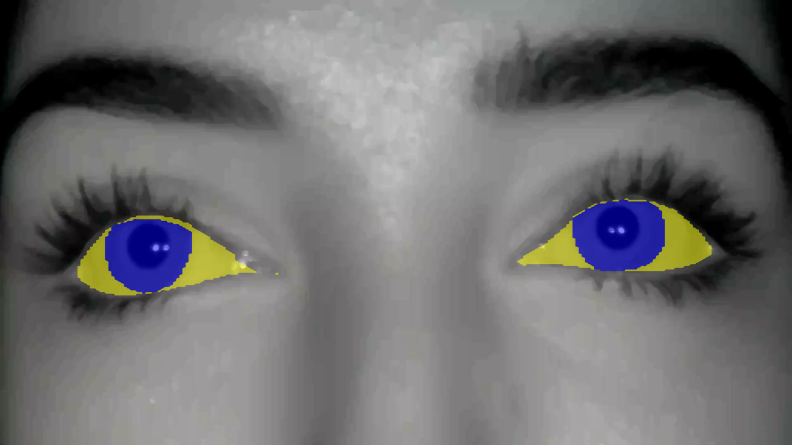

# Blink detection and classification
Blinking or blink patterns have been related with various pathological and neurological diseases, such as Computer Vision Syndrome, Tourette syndrome 
or even with Schizophrenia and Parkinson disease. 

This repository aims to introduce and make public a recent proposed methodology for blink detection and classification. For more details, see
this [paper](https://ieeexplore.ieee.org/abstract/document/9721639?casa_token=k2CNVAAC0SMAAAAA:jj4bMR1gsNPYAHqOpnHOWjcae5ihyuBYE20JNBfmSkjyYNpSF-T00WFPvzTNfqbznY3Pkwk3Cw).

The code can be executed in any version of Matlab and Octave, but requires Deep Learning Toolbox.

You are free to use those pretrained neural networks and code for any academic or non-academic purpose, provided that the code is redistributed as is, with the author credentials, 
and that the following paper is referenced:

> G. Nousias, E.-K. Panagiotopoulou, K. Delibasis, A. M. Chaliasou, A. Tzounakou and G. Labiris, "Video-based eye blink identification and classification," in IEEE Journal of Biomedical and Health Informatics, doi: 10.1109/JBHI.2022.3153407.

A short demo is provided where a sample image (close distance face image) is used to segment each area of eye in two categories, iris and sclera (also known as eyelids).
In the [main](code/main.m) script, two .mat files are loaded. Those contain a pretrained instance of DeepLabv3+ neural network, each one for each category (iris and eyelids).

After loading the two neural networks, a sample image (see in sample_images folder) is read
> sampleImg = imread('sample_img');

and then is resized to have the right dimensions, as the input layer of the arcitecture requires.
Then, the resized image is 'fed' in each neural network, seperately. The predictions occur using a self-build function [predictImg](code/predictImg.m) that utilizes
the following built-in MATLAB function:
>binaryImg = semanticseg(resizedImg,trainedNetwork);

The combined result is illustrated in the below image, each result from the iris and eyelid neural network, respectively.

The above results are part of [this](https://ieeexplore.ieee.org/abstract/document/9721639?casa_token=k2CNVAAC0SMAAAAA:jj4bMR1gsNPYAHqOpnHOWjcae5ihyuBYE20JNBfmSkjyYNpSF-T00WFPvzTNfqbznY3Pkwk3Cw) publication. For more details, contact anyone of the collaborators of this repo or open an issue.

## Results
A sample video is given below,after applying the methodology of publication. Important details are depicted on each frame (number of complete and incomplete blinks, current
distance of eyelids, known as palpebral fissure, diameter of iris, etc).

https://user-images.githubusercontent.com/94700816/157407879-0d2eacee-1a8a-43ed-89c4-be561290408a.mov
